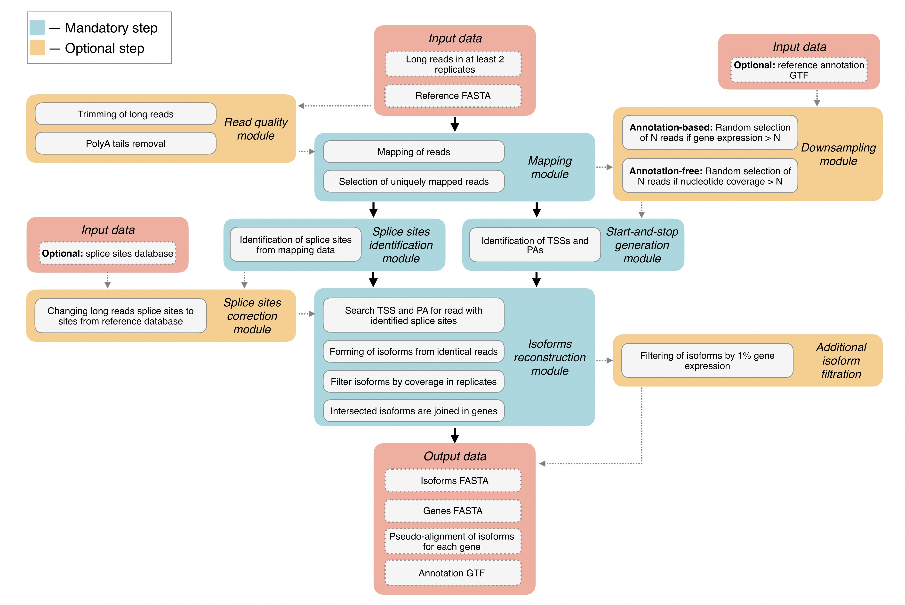

# FLIC: Full-Length Isoform Constructor

FLIC allows to reconstruct isoforms from transcription start site (TSS) to polyA site. 
The main source of information on isoform structure is long reads; in addition, tool uses genome assembly, annotation 
and a set of splice junction coordinates (_optional_). 
64-bit Linux and macOS are supported.

<div style='justify-content: center'>

</div>

## Overview
FLIC has a modular structure:

- <span style="font-size:1.1em;"> READ QUALITY MODULE </span> (<b><i> optional </i></b>) takes as input long reads, trim them by quality score together with polyA tail removal;
- <span style="font-size:1.1em;"> MAPPING MODULE </span> takes trimmed ONT reads and the reference genome assembly and maps them in a splice mode;
- <span style="font-size:1.1em;"> SPLICE SITES IDENTIFICATION MODULE </span> for each read, the coordinates of extended gaps labeled with the symbol “N” were extracted from the CIGAR string of an alignment and stored in an intermediate file;
- <span style="font-size:1.1em;"> SPLICE SITES CORRECTION MODULE </span> splice sites extracted from long read mapping are compared to the splice sites DB derived from Illumina read mapping or extracted from genome annotation to validate the splice sites derived from long reads;
- <span style="font-size:1.1em;"> DOWNSAMPLING MODULE </span> (<b><i> optional </i></b>) deals with highly expressed genes: for genes that produce large amount of RNA molecules the absolute number of long reads derived from tattered RNA is high which can result in incorrect TSS identification. To resolve the issue, a fixed number (1000 by default) of reads is randomly selected from all reads mapped on a highly expressed  gene. This step can be done using a genome annotation, if it is available, or can be run in an annotation-free mode. In the latter case at first step the coverage by uniquely mapped reads is calculated and compared with the threshold value (1000 by default). For regions for which the coverage exceeds this threshold, reads are randomly removed in an iterative way until all the positions in this region have coverage smaller than the threshold. It is recommended to use this optional module;
- <span style="font-size:1.1em;"> START-AND-STOP GENERATION MODULE </span> is based on peak calling. Mapped reads (either downsampled or not) are used for identification of regions corresponding to 5’-end coordinates (presumable TSSs) and 3’-end coordinates (possible polyA sites);
- <span style="font-size:1.1em;"> ISOFORMS RECONSTRUCTION MODULE </span> searches each read against a list of TSSs and polyA sites identified by start-and-stop generation module. Reads with identical TSS region, set of splicing sites and polyA sites region are grouped together and form isoform.  Correct isoforms are compared with each other by coordinates and join in genes.

## Installation
To begin, download FLIC:
```bash
git clone https://github.com/albidgy/FLIC
cd FLIC
```

FLIC requies Python (v. 3.10+) and R (v. 4.3+). The following external programs need to be installed for FLIC work:
- [Porechop v. 0.2.3+](https://github.com/rrwick/Porechop) (_optional_)
- [cutadapt v. 4.4+](https://github.com/marcelm/cutadapt) (_optional_)
- [minimap2 v. 2.24](https://github.com/lh3/minimap2)
- [samtools v. 1.15.1+](https://github.com/samtools/samtools)
- [bedtools v. 2.30.0](https://github.com/arq5x/bedtools2)
- [BedGraphToBigWig v. 4](https://github.com/ENCODE-DCC/kentUtils)

To install this programs in separate conda environment ```flic_env```, run the _create_flic_env.sh_ script:
```bash
bash create_flic_env.sh
```

The installation of the R [CAGEfightR](https://bioconductor.org/packages/release/bioc/html/CAGEfightR.html) and [argparse](https://cran.r-project.org/web/packages/argparse/index.html) packages is also required. Note that R packages need to be installed sequentially.
```R
if (!require("BiocManager", quietly = TRUE))
    install.packages("BiocManager")
BiocManager::install("CAGEfightR")
```
```R
install.packages("argparse")
```

Next install FLIC using pip:
```bash
pip3 install .

# check FLIC installation
flic --help
```

## Command line options
```bash
flic [OPTIONS] --long_reads /path/to/ont_rep1.fastq,/path/to/ont_rep2.fastq \
--ref_fasta /path/to/reference_fasta.fasta \
--ref_annot /path/to/reference_annotation.gtf
```
<span style="font-size:1.2em;"> General arguments </span>

```
--long_reads              Long reads at least in 2 replicates in fastq, fastq.gz or sam format separated by commas. 
                          Example: /path/to/ont_rep1.fastq,/path/to/ont_rep2.fastq
                    
--ref_fasta               Path to reference FASTA file. 
                          Example: /path/to/reference_fasta.fasta
                    
-t / --threads            Number of threads [default: 1]

-o / --output_dir         Output directory [default: ./res_flic_YEAR_MONTH_DAY_HOUR_MINUTE_SECOND]

--trim_long_reads         (Read quality module) Add trimming long reads step by using Porechop tool

--cut_adapt               (Read quality module) Cut polyA tail of long reads by using cutadapt tool

--make_downsampling       (Downsampling module) Make a downsampling long reads by given threshold

--extra_filter_iso        (Isoforms reconstruction module) Perform additional filtering of final isoforms 
                          based on expression levels greater than or equal to 1% of total gene expression. 
                          NOTE: gene boundaries will not be changed

-v / --version            Show a version of tool and exit
```
<span style="font-size:1.2em;"> Optional arguments </span>

```
--ref_annot               Path to reference annotation file in GTF format.
                          Example: /path/to/reference_annotation.gtf
                          
--splice_sites            (Splice sites correction module) Path to file with a list of splice sites

--downsampling_min_thr    (Downsampling module) Number of reads per gene less than a specified value is 
                          considered noise and is excluded from the analysis [default: 5]
                          
--downsampling_max_thr    (Downsampling module) Maximum number of reads per gene remaining after 
                          downsampling [default: 1000]

--iso_thr1                (Isoforms reconstruction module) Minimum number of reads forming an isoform at 
                          least in 1 replicate [default: 5]

--iso_thr2                (Isoforms reconstruction module) Minimum number of reads forming an isoform in 
                          another replicate [default: 1]
```
FLIC is based on the assumption that convergence of isoforms across replicates is extremely important for isoform reconstruction. 
In this regard, at least 2 replicates are required for the program to work correctly.

As output FLIC provides reconstructed isoforms and genes in FASTA format along with pseudo-alignment of isoforms for each gene and annotation in GTF format.

You can run the FLIC tool on test data:
```bash
flic --long_reads ./example/long_reads/rep1.fastq.gz,./example/long_reads/rep2.fastq.gz,./example/long_reads/rep3.fastq.gz \
--ref_fasta ./example/genome/athaliana_1Mb.fasta --ref_annot ./example/genome/athaliana_1Mb.gtf \
--splice_sites ./example/splice_sites.tsv --cut_adapt --make_downsampling --extra_filter_iso -t 5
```
Assuming you are in the FLIC directory, use this command.

## Troubleshooting
If you have an error: __"bedGraphToBigWig: error while loading shared libraries: libssl.so.1.0.0: cannot open shared object file: No such file or directory"__, you can try to resolve it by installing correct version of library using the following commands:
```bash
wget http://security.ubuntu.com/ubuntu/pool/main/o/openssl1.0/libssl1.0.0_1.0.2n-1ubuntu5.13_amd64.deb
sudo apt install ./libssl1.0.0_1.0.2n-1ubuntu5.13_amd64.deb
```
